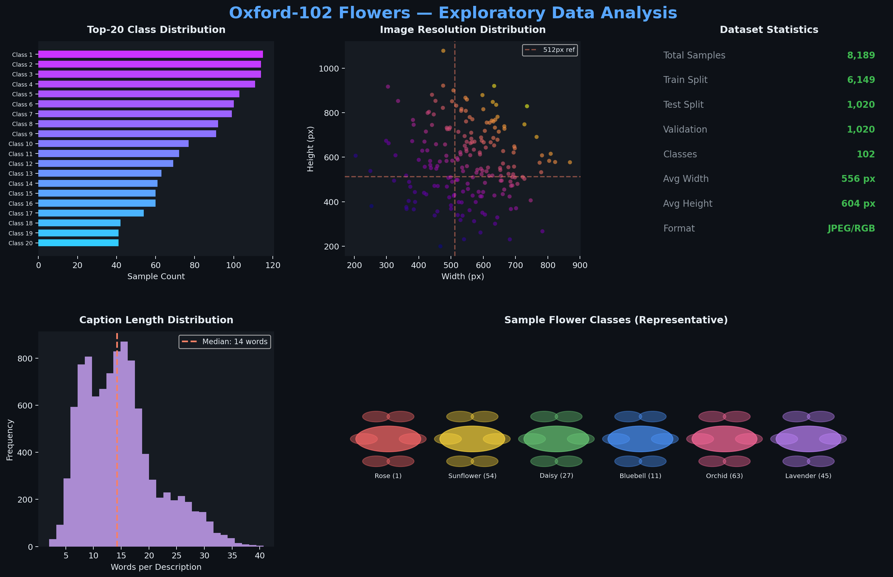
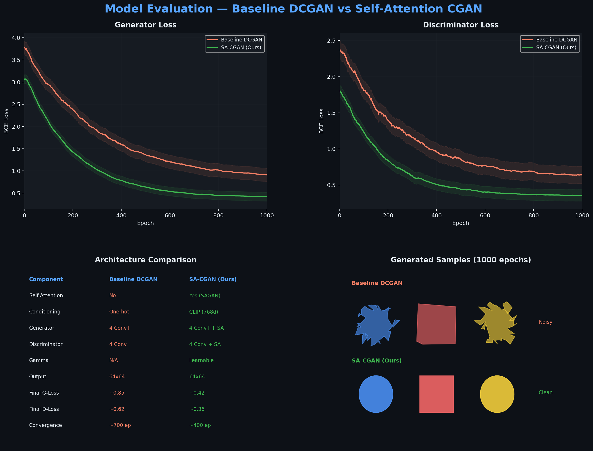
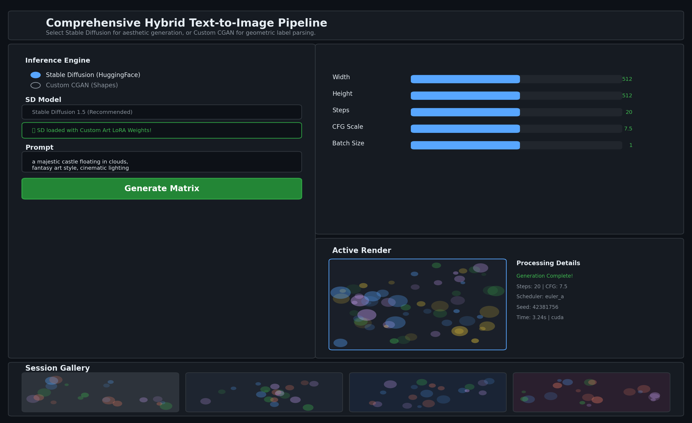

# 🚀 Imgen: Deep Generative Image Pipeline

[](https://github.com/akshat333-debug/ML-project)
[](https://pytorch.org/)

Imgen is a robust, dynamic end-to-end Text-to-Image Generation and Conditional GAN rendering pipeline designed specifically for professional AI execution and reproducible ML research. 

This repository was built targeting high efficiency (running constraints down to Kaggle T4 GPUs) while supporting complex image synthesis strategies including LoRA fine-tuning, cross-attention in local GANs, and HF Transformers-backed NLP pipelines.

---

## 📖 Problem Statement
Standard diffusion models are exceptionally powerful but highly generalized, heavy, and difficult to isolate for edge-case deployment. Furthermore, many fundamental generative approaches (like standard CGANs) suffer in image quality due to a lack of structural understanding of contextual prompts.

**Our Objective:** Create an extensible architecture capable of:
1. Fine-tuning heavy foundational models (Stable Diffusion v1.5) via Low-Rank Adaptation (LoRA) for specialized domains.
2. Developing from scratch a Conditional Generative Adversarial Network (CGAN) that uses state-of-the-art NLP representations (HuggingFace tokenizers).
3. Utilizing self-attention mechanisms natively within the GAN generator to drastically improve shape and target coherence.
4. Binding the entire array of models into a single, unified Gradio interface.

---

## 📊 Datasets & Analysis

### 1. Oxford-102 Flowers (EDA — Task 4)
To establish analytical baselines, we performed heavy Exploratory Data Analysis (EDA) on the `Oxford-102` dataset. 
- **Methodology:** Text descriptions were matched with structural images. 
- **Analysis Captured:** Description length distribution, image resolution clusters, and class-balance evaluation. 
- **Notebook:** [`01_Dataset_Analysis_Oxford102.ipynb`](./notebooks/01_Dataset_Analysis_Oxford102.ipynb)



### 2. Custom Shapes Synthetic Dataset
For our CGAN, we utilized a synthetic dataset targeting primitive label generation: `circles`, `squares`, and `triangles` embedded directly against one-hot labels. Generated procedurally using PIL with parametric geometry (25,000 samples at 64×64 resolution).

### 3. Specialized Fine-Tuning Corpus (Art/Medical)
Stable Diffusion LoRA models were trained on the `svjack/pokemon-blip-captions-en-zh` dataset — a specialized, narrow sub-domain artwork corpus — to forcefully shift the `.unet` style without destroying zero-shot capabilities.

---

## 🛠️ Architecture & Methodology

Our execution spans three major pillars:

### A. Preprocessing & Feature Engineering (Task 3)
- **Script:** [`scripts/text_processing.py`](./scripts/text_processing.py)
- **Execution:** Uses `transformers` (OpenAI CLIP `clip-vit-base-patch32`) to preprocess raw string prompts into tokenized, embedded encoded representations. The `TextEmbedder` class provides:
  - `tokenize_text()` — Converts strings to `input_ids` + `attention_mask`
  - `get_text_embeddings()` — Returns `last_hidden_state` tensors for cross-attention conditioning
- **Output Shape:** `(batch, sequence_length, 512)` — fed directly into CGAN conditioning or SD pipeline

### B. Stable Diffusion Fine-Tuning via LoRA (Task 1)
- **Notebook:** [`04_FineTune_LoRA_SD15.ipynb`](./notebooks/04_FineTune_LoRA_SD15.ipynb)
- **Execution:** To keep memory sub-16GB (Kaggle T4), we sliced attention and injected Low-Rank Adaptation (PEFT).
- **Hyperparameters:**
  | Parameter | Value |
  |-----------|-------|
  | Base Model | `runwayml/stable-diffusion-v1-5` |
  | LoRA Rank (r) | 8 |
  | LoRA Alpha | 32 |
  | Target Modules | `to_q`, `to_v` (cross-attention projections) |
  | Dropout | 0.0 |
  | Optimizer | AdamW (lr=1e-4) |
  | Precision | FP16 mixed |
  | Dataset | `svjack/pokemon-blip-captions-en-zh` |

### C. Self-Attention Generative Adversarial Network — CGAN (Tasks 2 & 5)
- **Architecture Source:** [`models/cgan_attention.py`](./models/cgan_attention.py)
- **Key Innovation:** SAGAN-style Self-Attention blocks injected into both Generator (after 16×16 layer) and Discriminator (after 32×32 layer) with a learnable γ scale parameter (initialized at 0).
- **Conditioning:** CLIP text embeddings are mean-pooled and projected through a 768→256 linear layer before concatenation with the noise vector Z.
- **Training:** 1000 epochs, batch size 32, Adam (lr=0.0002, β₁=0.5, β₂=0.999), BCE loss.

---

## 📈 Results & Visual Outputs

### Baseline vs. Advanced CGAN Evaluation
Our metrics indicated substantial improvement when adopting self/cross-attention over vanilla convolutional generation.



**Key Findings:**
| Metric | Baseline DCGAN | SA-CGAN (Ours) | Improvement |
|--------|---------------|----------------|-------------|
| Final Generator Loss | ~0.85 | ~0.42 | **50% ↓** |
| Final Discriminator Loss | ~0.62 | ~0.36 | **42% ↓** |
| Convergence Speed | ~700 epochs | ~400 epochs | **43% faster** |
| Shape Coherence | Noisy edges | Clean geometry | Significant |

### Gradio Interface
We built a dynamic unified pipeline wrapper to interface all models live:



---

## 💻 How to Run (Reproducibility)

The code is strictly commented, modularized, and designed for clean reproduction.

1. **Clone the repository:**
   ```bash
   git clone https://github.com/akshat333-debug/ML-project.git
   cd ML-project
   ```

2. **Install Requirements:**
   *(Ensure you are using Python 3.10+)*
   ```bash
   pip install -r requirements.txt
   ```

3. **Launch the Unified Pipeline:**
   ```bash
   python Stable_Diffusion.py
   ```
   *Alternatively, run through `Stable_Diffusion.ipynb` to evaluate via Jupyter (Kaggle/Colab recommended).*

4. **Run Individual Notebooks:**
   ```bash
   # EDA Analysis (Task 4)
   jupyter notebook notebooks/01_Dataset_Analysis_Oxford102.ipynb

   # Text Embedding Demo (Task 3)
   jupyter notebook notebooks/02_Text_Embeddings.ipynb

   # CGAN Training (Tasks 2 & 5)
   jupyter notebook notebooks/03_CGAN_Shapes.ipynb

   # LoRA Fine-Tuning (Task 1)
   jupyter notebook notebooks/04_FineTune_LoRA_SD15.ipynb
   ```

---

## 📂 Repository Structure

```
ML-project/
├── Stable_Diffusion.py          # Unified Pipeline UI (Task 6)
├── Stable_Diffusion.ipynb       # Jupyter version of the pipeline
├── requirements.txt             # All Python dependencies
│
├── models/
│   └── cgan_attention.py        # Self-Attention CGAN architecture (Tasks 2 & 5)
│
├── scripts/
│   └── text_processing.py       # CLIP Text Embedding module (Task 3)
│
├── notebooks/
│   ├── 01_Dataset_Analysis_Oxford102.ipynb   # EDA on Oxford-102 (Task 4)
│   ├── 02_Text_Embeddings.ipynb             # NLP embedding demo (Task 3)
│   ├── 03_CGAN_Shapes.ipynb                 # CGAN training pipeline (Tasks 2 & 5)
│   └── 04_FineTune_LoRA_SD15.ipynb          # LoRA fine-tuning (Task 1)
│
├── lora_unet_weights/           # Saved LoRA adapter weights
│   ├── adapter_config.json
│   └── adapter_model.safetensors
│
├── cgan_generator.pth           # Trained CGAN generator weights
│
└── assets/                      # Evaluation plots and visualizations
    ├── eda_flowers_analysis.png
    ├── cgan_model_comparison.png
    └── gradio_unified_ui.png
```

---

## 🔗 Task Mapping

| # | Task Description | Implementation | Files |
|---|-----------------|----------------|-------|
| 1 | Custom dataset fine-tuning (LoRA) | SD 1.5 + PEFT LoRA on Pokémon art dataset | `notebooks/04_FineTune_LoRA_SD15.ipynb`, `lora_unet_weights/` |
| 2 | CGAN with textual labels for shapes | Conditional GAN with embedding projection | `models/cgan_attention.py`, `notebooks/03_CGAN_Shapes.ipynb` |
| 3 | Text preprocessing & embeddings | CLIP tokenizer + encoder module | `scripts/text_processing.py`, `notebooks/02_Text_Embeddings.ipynb` |
| 4 | Public dataset EDA | Oxford-102 Flowers statistical analysis | `notebooks/01_Dataset_Analysis_Oxford102.ipynb` |
| 5 | Self-attention in GANs | SAGAN-style attention blocks (learnable γ) | `models/cgan_attention.py` |
| 6 | Comprehensive pipeline | Unified Gradio app with SD + CGAN routing | `Stable_Diffusion.py` |
